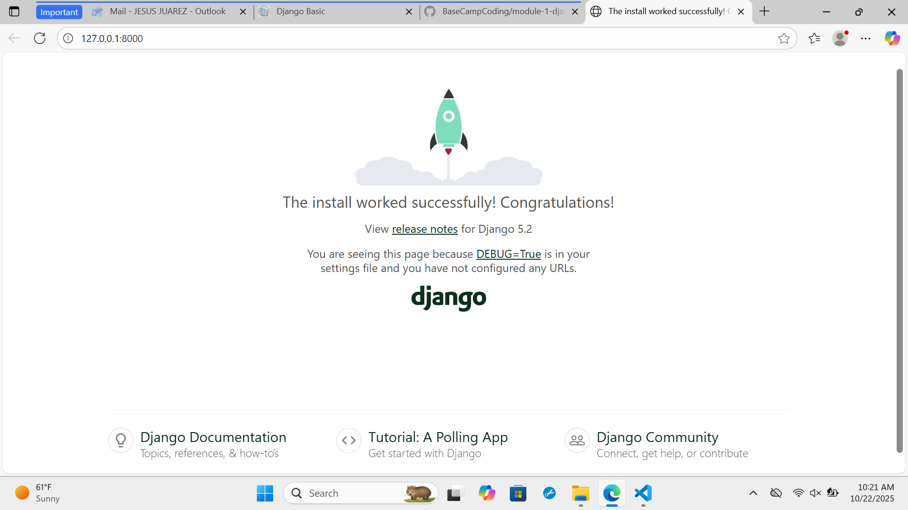

1. python -m venv .venv

2. .\\.venv\Scripts\Activate.ps1 

3. pip install django

4. django-admin startproject "facebok_clone" .

5. python manage.py startapp app

6. python manage.py migrate

7. python manage.py runserver

